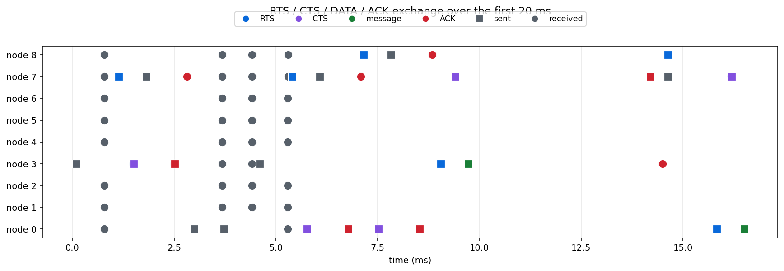

# Wireless Simulation with ns2

An ns2 simulation of a wireless network using RTS/CTS medium access, with trace
analysis of the resulting frame exchange.



## Requirements

[ns2](https://www.isi.edu/nsnam/ns/) to run the simulations. The trace analysis
needs Python with matplotlib, and the traces are committed, so the analysis runs
without ns2 installed.

## Running

```bash
ns WLAN_1.5Mbps.tcl      # writes rts-cts-data-ack_1.5Mbps.tr
```

Analyse the committed traces:

```bash
python tools/analyse_traces.py
```

## Why RTS/CTS

Two stations can be in range of an access point but not of each other. Neither
hears the other transmit, so both conclude the medium is free and both transmit,
and the frames collide at the receiver. Listening before transmitting does not
help, because the thing worth hearing is inaudible.

RTS/CTS fixes this by moving the arbitration to the receiver. A sender asks with
a short Request To Send; the receiver answers with a Clear To Send that
*everyone* in its range hears, including the station the sender cannot reach.
That station now knows to stay quiet. The cost is two extra frames per data
frame, which is why it is worth it for large frames and not for small ones.

The figure shows this: the grey markers are frames received by nodes that were
not the intended recipient, which is exactly the audience the CTS is aimed at.

## Frame counts

From `rts-cts-data-ack_1.5Mbps.tr`, a 99-second run:

| frame | count |
| --- | --- |
| RTS | 837 |
| CTS | 818 |
| DATA | 806 |
| ACK | 818 |
| ARP | 67 |

The nineteen RTS frames without a matching CTS are the collisions and timeouts
the mechanism is there to detect: the sender asks, hears nothing back, and backs
off rather than transmitting a full data frame into a collision.

## A note on the three link rates

Three scripts set `Mac/Simple bandwidth_` to 1.5, 55 and 155 Mbps, and three
traces are committed. The 1.5 and 55 Mbps traces are byte-identical, and the
155 Mbps trace differs from them only in its final timestamp, by about 1.5
microseconds over 99 seconds.

That is a property of the model rather than a mistake in the analysis.
`Mac/Simple` does not model transmission time as a function of link rate the way
`Mac/802_11` does, so raising the configured bandwidth changes almost nothing
about when frames appear. Comparing rates meaningfully needs the 802.11 MAC.

## Project structure

```
WLAN_1.5Mbps.tcl, WLAN_55Mbps.tcl, WLAN_155Mbps.tcl   the simulations
rts-cts-data-ack_*.tr                                  the traces they produced
rts-cts-data-ack-temp.nam                              network animator output
analyser.ipynb                                         the original trace analysis
tools/analyse_traces.py                                frame counts and the figure
docs/handshake.png                                     the figure above
```
